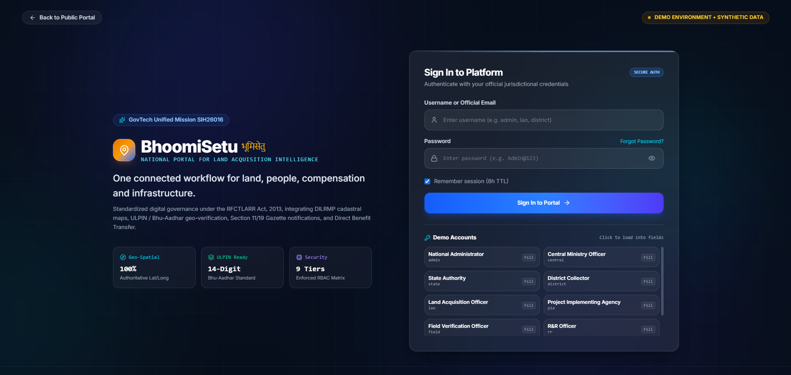
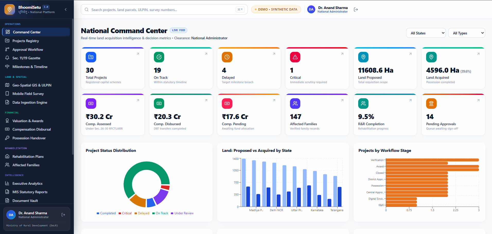
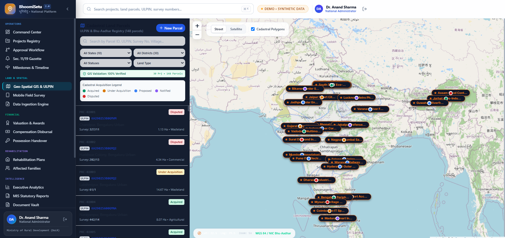
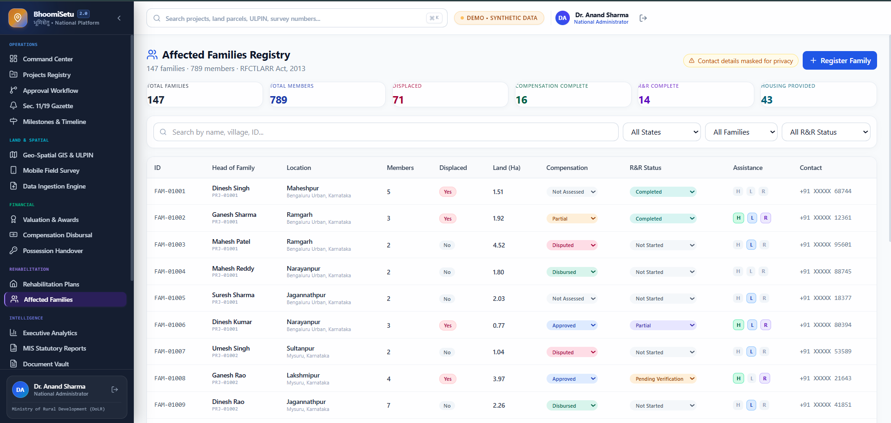
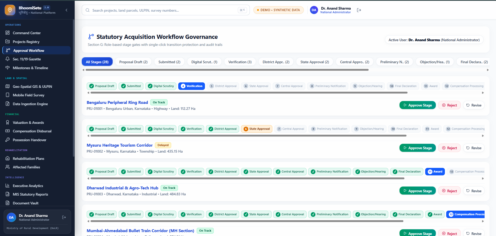

<div align="center">

# 🏛️ BHOOMISETU

### National Land Acquisition & Management Intelligence Platform

**One connected workflow for Land • People • Compensation • Rehabilitation**

[🚀 Live Demo](https://bhoomi-setu-sih26016.vercel.app/)  
**SIH 2026 • SIH26016**

</div>

---

## 🎯 What is BhoomiSetu?

BhoomiSetu is a unified digital platform that connects the complete land acquisition lifecycle into one operational view.

**Land → GIS → Projects → Approvals → Compensation → R&R → Monitoring**

It helps authorities track projects, parcels, affected families, compensation and workflow progress from a single platform.

---

## ✨ Key Features

| Module | What it provides |
|---|---|
| 📊 **Command Center** | National-level project & acquisition overview |
| 🗺️ **GIS & ULPIN** | Parcel visualization and acquisition status |
| 👨‍👩‍👧 **Families Registry** | Affected-family and R&R tracking |
| 🔄 **Workflow Governance** | Statutory stage & approval tracking |
| 💰 **Compensation** | Assessed, pending & disbursed compensation |
| 📈 **Analytics** | Project, land & workflow insights |
| 🔐 **Role-Based Access** | Role-oriented administrative workflows |

---

## 🖥️ Platform Preview

### 🔐 Secure Portal



### 📊 National Command Center



### 🗺️ GIS & ULPIN



### 👨‍👩‍👧 Affected Families Registry



### 🔄 Statutory Acquisition Workflow



---

## 🔁 End-to-End Workflow

```text
Project Initiation
        ↓
Land Identification
        ↓
GIS / ULPIN Verification
        ↓
Digital Scrutiny
        ↓
Field Verification
        ↓
Statutory Approvals
        ↓
Notification & Hearing
        ↓
Final Declaration
        ↓
Award
        ↓
Compensation
        ↓
Rehabilitation & R&R
        ↓
Possession
        ↓
Monitoring & Reporting

🧠 Why BhoomiSetu?
Traditional acquisition processes can become fragmented across departments, documents and workflows.
BhoomiSetu connects:
LAND + PROJECTS + GIS + PEOPLE + FINANCE + R&R + GOVERNANCE
into a single operational platform.
🛠️ Technology
- ⚛️ React
- 🔷 TypeScript
- ⚡ Vite
- 📊 Dashboard-based UI
- 🗺️ GIS-oriented visualization
- 📱 Responsive web interface
🚀 Run Locally
git clone https://github.com/CodeeSAI/BhoomiSetu-sih26016.git
cd BhoomiSetu-sih26016
npm install
npm run dev

Open the local URL shown in the terminal.
🌐 Live Demo
🚀 Launch BhoomiSetu
The deployed prototype uses synthetic/demo data and is intended for demonstration purposes only.

🏆 Smart India Hackathon 2026
Problem Statement: SIH26016
Domain: Land Acquisition Management
BhoomiSetu
Connecting Land • People • Compensation • Rehabilitation • Infrastructure
<div align="center">

From fragmented processes to connected governance.
🏛️ BHOOMISETU
</div>
```
